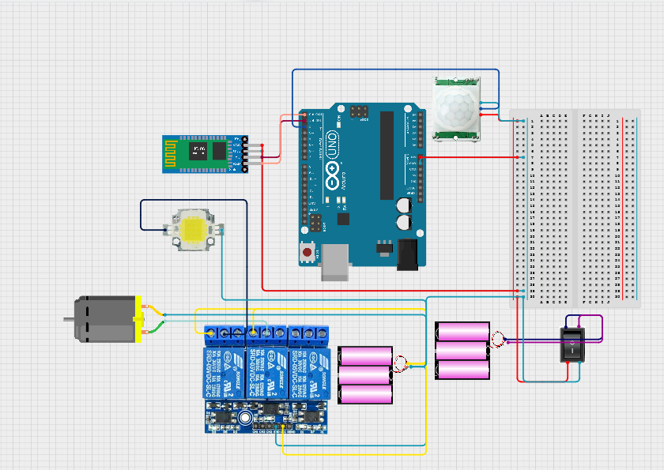

# 🏠 Home Automation

This project is designed to facilitate the control of home electronic and electrical systems in a more convenient and efficient manner. It enables users to manage various devices using a mobile phone via Bluetooth.

This project is built using **Arduino**, and the code is provided in `.ino` format.

## 🎯 Project Goals

1. 💰 Minimize operating costs (around **$15**)
2. 🛋️ Improve comfort
3. 📈 Optimize inhabitant productivity
4. 🔐 Ensure security
5. 🤖 Simplify the use of modern technologies

## 🔧 Components Used

1. **Arduino Leonardo**  
2. **Bluetooth Module (HC-05)**  
3. **Relay Module**  
4. **Cables & Connectors**  
5. **PCB and Breadboards**  
6. **Switches**  
7. **Electrical Devices** (e.g., lights, fans)  
8. **PIR Sensor** (Motion sensor)  

## 📂 Code

- The Arduino source code is available in `.ino` format.

---

flow chart:

Trips:

    1.We can make a password checker function for ensuring privacy or else any one can send signal and take over the access of this system.
    2.We can use Xor property to hide or encrypy data like (Time ^ password ^ extra)
    3.We can use cheaper components for cost cutting.
    4.Anyone can use pre-build blutooth controller in play store or make their own app to accss remotely.
    5.We used difference of starting time and present time to detect if the time is over for a device to turn off or not

#Circuit:

